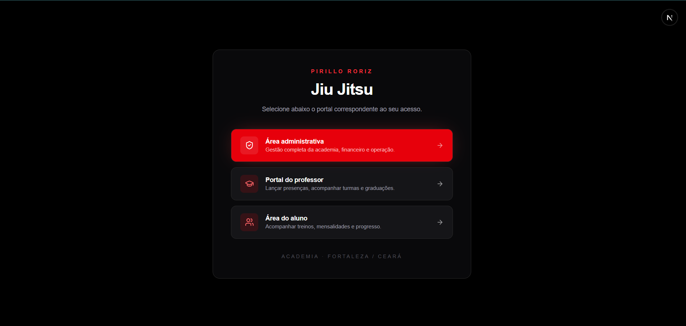
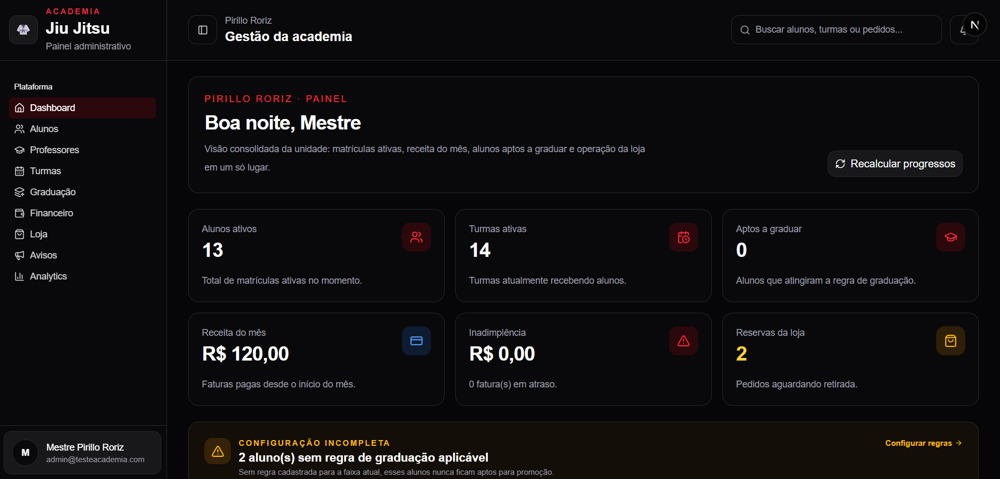
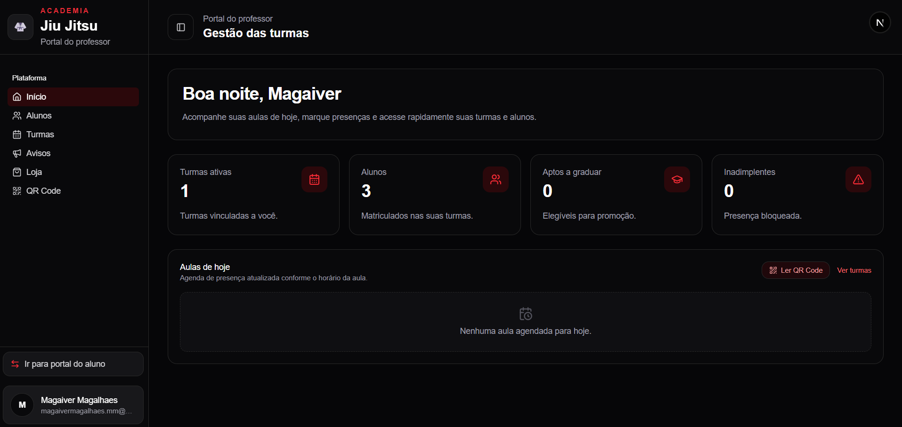
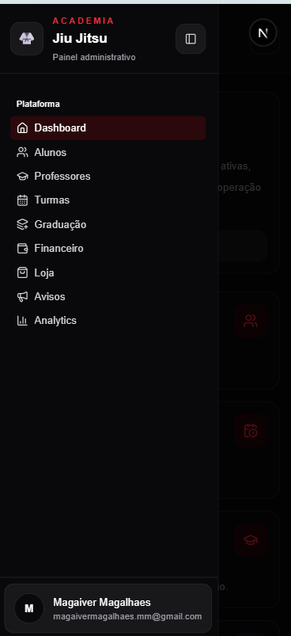

# Pirillo Roriz — Sistema de Gestão de Academia de Jiu-Jitsu

Plataforma web completa para administrar alunos, professores, turmas, graduação, financeiro, loja, avisos e analytics de uma academia de Jiu-Jitsu. Desenvolvida para a **Academia Pirillo Roriz** (Fortaleza/CE), com três portais independentes: **administrativo**, **professor** e **aluno**.

---

## Visão geral

O sistema centraliza a operação da academia em um único produto, com identidade visual **dark mode** e acento **vermelho** (`red-500/600`). Cada perfil de usuário acessa apenas o portal correspondente ao seu papel.

| Portal | Rota base | Público |
|--------|-----------|---------|
| Administrativo | `/admin` | Admin master, admin e recepção |
| Professor | `/professor` | Instrutores ativos |
| Aluno | `/aluno` | Alunos matriculados |

A tela inicial permite escolher o portal de acesso:



---

## Capturas de tela

### Painel administrativo

Dashboard com métricas operacionais, receita, inadimplência, reservas da loja e alertas de configuração.



### Portal do professor

Visão das turmas, alunos, aulas do dia, presenças via QR Code e avisos.



### Versão mobile

Layout responsivo com sidebar colapsável e navegação adaptada para telas menores.



---

## Funcionalidades principais

### Área administrativa (`/admin`)

- **Alunos** — cadastro, edição, histórico de presença, progresso de graduação e financeiro individual
- **Professores** — cadastro e gestão de instrutores
- **Turmas** — tipos, horários, capacidade, matrículas e configurações
- **Graduação** — regras por faixa, idade e critérios de promoção
- **Financeiro** — planos, mensalidades, cobranças, pagamentos, inadimplência e relatórios
- **Loja** — produtos, estoque, reservas e retirada presencial
- **Avisos** — comunicados para alunos e professores
- **Analytics** — indicadores, heatmap de presença, funil e pirâmide de faixas

### Portal do professor (`/professor`)

- Dashboard com turmas ativas, alunos e indicadores do dia
- Lançamento de presença manual e via **QR Code**
- Gestão de alunos e turmas vinculadas
- Avisos e loja (reservas)
- Visualização de progresso e histórico dos alunos

### Portal do aluno (`/aluno`)

- **QR Code** pessoal para check-in nas aulas
- **Avisos** com badge de não lidos
- **Loja** com reserva de produtos
- **Presença** — heatmap da jornada, barra de progresso e histórico

---

## Stack tecnológica

| Camada | Tecnologia |
|--------|------------|
| Framework | [Next.js 16](https://nextjs.org) (App Router) |
| Linguagem | TypeScript (strict) |
| Banco de dados | [PostgreSQL](https://www.postgresql.org) via [Neon](https://neon.tech) |
| ORM | [Prisma 7](https://www.prisma.io) |
| Autenticação | [Better Auth](https://www.better-auth.com) |
| UI | [Tailwind CSS v4](https://tailwindcss.com) + [shadcn/ui](https://ui.shadcn.com) |
| Validação | [Zod](https://zod.dev) |
| Gráficos | [Recharts](https://recharts.org) |
| QR Code | `qrcode` + `html5-qrcode` |
| Email | [Resend](https://resend.com) |
| Notificações | [Sonner](https://sonner.emilkowal.ski) |

---

## Arquitetura

A lógica de negócio vive em **`src/modules/[domínio]/`**, separada das pages do App Router:

```
src/
├── app/                    # Rotas (Server Components)
│   ├── (admin)/admin/      # Portal administrativo
│   ├── (professor)/        # Portal do professor
│   ├── (aluno)/            # Portal do aluno
│   └── api/auth/           # Better Auth handler
├── modules/                # Domínios de negócio
│   ├── students/
│   ├── instructors/
│   ├── classes/
│   ├── finance/
│   ├── graduation-rules/
│   ├── store/
│   ├── warnings/
│   ├── analytics/
│   ├── student-portal/
│   ├── instructor-portal/
│   └── ...
├── lib/                    # Utilitários globais (auth, db, academy)
└── components/             # Componentes reutilizáveis
```

Cada módulo segue a estrutura:

- `types/` — tipos do domínio
- `schemas/` — validação Zod
- `queries/` — leitura de dados (Server Components)
- `actions/` — mutações (Server Actions)
- `components/` — UI (Client Components quando necessário)

> Documentação técnica detalhada: [`docs/DOCUMENTACAO-TECNICA.md`](./docs/DOCUMENTACAO-TECNICA.md)

---

## Pré-requisitos

- **Node.js** 20+
- **npm** 10+
- Conta **Neon** (PostgreSQL) ou banco PostgreSQL local
- Conta **Resend** (opcional, para envio de senhas por email)

---

## Configuração local

### 1. Clonar e instalar

```bash
git clone <url-do-repositorio>
cd pirillo-roriz
npm install
```

O script `postinstall` executa `prisma generate` automaticamente.

### 2. Variáveis de ambiente

Copie o template e preencha os valores:

```bash
cp .env.example .env
```

| Variável | Descrição |
|----------|-----------|
| `DATABASE_URL` | Connection string do PostgreSQL (Neon) |
| `BETTER_AUTH_SECRET` | Secret para sessões (gere com `openssl rand -base64 32`) |
| `BETTER_AUTH_URL` | URL base da app (`http://localhost:3000` em dev) |
| `NEXT_PUBLIC_APP_URL` | URL pública da app |
| `ADMIN_EMAIL` | Email do admin inicial |
| `ADMIN_PASSWORD` | Senha do admin inicial |
| `ADMIN_NAME` | Nome exibido do admin |
| `RESEND_API_KEY` | Chave da API Resend |
| `MAIL_FROM` | Remetente dos emails (ex.: `Academia <onboarding@resend.dev>`) |

### 3. Banco de dados

```bash
npx prisma migrate deploy   # aplica migrations em produção
# ou, em desenvolvimento:
npx prisma migrate dev
```

### 4. Executar

```bash
npm run dev
```

Acesse [http://localhost:3000](http://localhost:3000).

---

## Scripts disponíveis

| Comando | Descrição |
|---------|-----------|
| `npm run dev` | Servidor de desenvolvimento |
| `npm run build` | Build de produção |
| `npm run start` | Servidor de produção |
| `npm run lint` | ESLint |
| `npm run typecheck` | Verificação TypeScript |
| `npx prisma studio` | Interface visual do banco |
| `npx tsx scripts/repair-portal-access.ts` | Vincula alunos/professores sem `userId` |
| `npx tsx scripts/reset-portal-password.ts <email>` | Redefine senha de portal |

---

## Autenticação e papéis

O sistema usa **Better Auth** com login por email/senha. Os papéis (`AppRole`) são:

| Papel | Acesso |
|-------|--------|
| `ADMIN_MASTER` | Admin completo |
| `ADMIN` | Admin operacional |
| `RECEPTION` | Recepção (admin limitado) |
| `INSTRUCTOR` | Portal do professor |
| `STUDENT` | Portal do aluno |
| `GUARDIAN` | Responsável (futuro) |

- Rotas `/admin`, `/professor` e `/aluno` são protegidas por **middleware** (cookie de sessão).
- Server Actions administrativas usam `assertAdminAction()` para validar permissão.
- Portais de aluno e professor usam `requireStudentContext()` e `requireInstructorContext()`.

---

## Deploy na Vercel

1. Conecte o repositório na [Vercel](https://vercel.com).
2. Configure todas as variáveis de `.env.example` no painel da Vercel.
3. Ajuste `BETTER_AUTH_URL` e `NEXT_PUBLIC_APP_URL` para a URL de produção.
4. O build executa `prisma generate` (via `postinstall`) e `next build` automaticamente.
5. Execute `npx prisma migrate deploy` contra o banco de produção antes ou após o primeiro deploy.

---

## Design system

- **Tema:** dark mode exclusivo (`bg-zinc-950`, `bg-zinc-900`)
- **Acento primário:** `red-500` / `red-600`
- **Acento positivo:** `emerald-400`
- **Acento atenção:** `amber-500`
- **Cards:** `rounded-2xl border border-white/10`
- **Código em inglês**, **UI em português**

---

## Licença

Projeto privado — Academia Pirillo Roriz.
